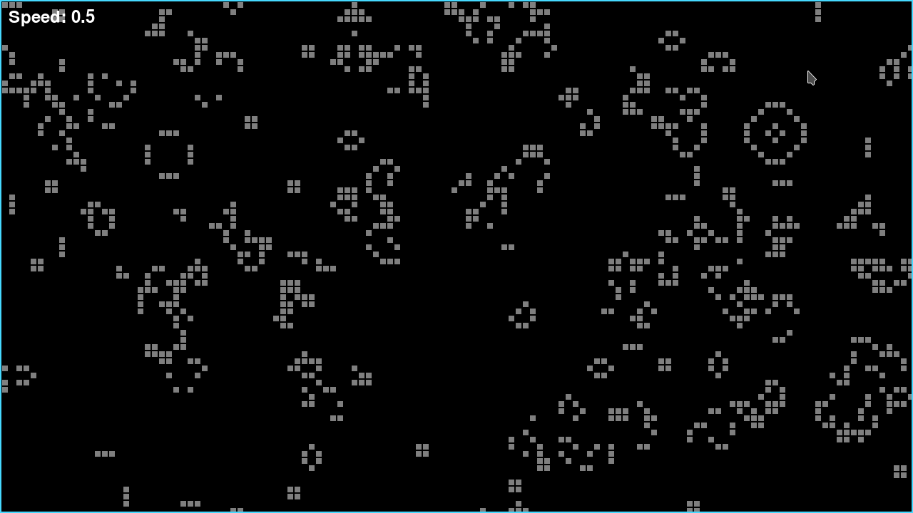

# Conway's Game of Life (C - SDL2)
Conway's Game of Life is a classic cellular automaton devised by British mathematician John Horton Conway in 1970. It's a zero-player game, meaning its evolution is determined by its initial state, with no further input from humans. Despite its simplicity, the Game of Life exhibits complex and fascinating patterns.

* If a dead cell has exactly three live neighbors, it becomes alive in the next generation.
* If a live cell has two or three live neighbors, it remains alive in the next generation.
* In all other cases, a cell dies or remains dead.

# Build
To build the game-of-life binary you will need all required build tools needed to compile via Makefile and gcc. You will also need SDL2 SDL2_image and SDL2_ttf both the libraries and headerfiles. This was created in linux where the SDL2 headerfiles are in the SDL2 folder.

## ArchLinux instructions.

    sudo pacman -S --needed base-devel
    sudo pacman -S --needed sdl2 sdl2_image sdl2_ttf
    make release run

# Controls
Up Arrow - Speeds up the game.\
Down Arrow - Slows down the game.\
Space Bar - Pauses the game.\
Escape - Quits the game.\
R - Resets and randomises the board.\
C - Clears the board.\
Mouse Click - Toggles a cell on/off.\
F - Prints the FPS to the console.
